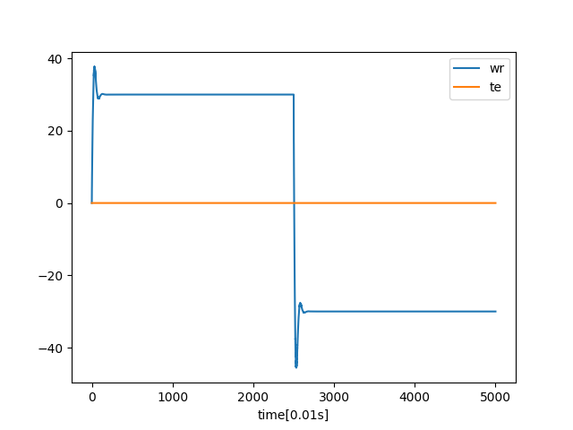

# Motor simulator

Runge kutta 4 with adaptive step size

## Controllers

Built in FOC (Field Oriented Control)

Reinforcement learning: motor\_client.py

## How to use

Build the motor

    cd motor_sim
    ./build.sh

This will generate the pmsm\_server

Run the server

    ./pmsm_server

open new terminal, and start training with:

    python motor_client.py

examine results with: 

    python plot.py 

tensorboard data inside log folder

    tensorboard --logdir ./logs 

